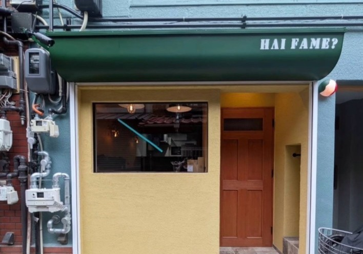

# 📖 Hai Fame? - 取扱説明書（編集ガイド）

このドキュメントでは、ウェブサイトの内容を自分で編集する方法を、初心者の方にもわかりやすく説明します。

---

## 📚 目次

1. [はじめに](#はじめに)
2. [開発環境のセットアップ](#開発環境のセットアップ)
3. [基本的な編集方法](#基本的な編集方法)
4. [ページ別編集ガイド](#ページ別編集ガイド)
5. [よくある編集タスク](#よくある編集タスク)
6. [トラブルシューティング](#トラブルシューティング)

---

## はじめに

### このマニュアルでできること

✅ テキストの変更（店名、説明文など）  
✅ 画像の差し替え  
✅ メニュー項目の追加・削除・変更  
✅ 色やデザインの調整  
✅ 営業時間や連絡先の更新  

### 必要な知識

- ⭐ 基本的なパソコン操作
- ⭐ テキストエディタの使い方
- ⭐⭐ HTML/CSSの基礎知識（あると便利）

---

## 開発環境のセットアップ

### 1. 必要なソフトウェア

#### Node.js（ノード・ジェイエス）
JavaScriptを動かすための環境です。

**インストール方法：**
1. [Node.js公式サイト](https://nodejs.org/)にアクセス
2. 「LTS」版をダウンロード
3. インストーラーを実行

**確認方法：**
```bash
node --version
# v18.0.0 のようなバージョンが表示されればOK
```

#### テキストエディタ
コードを編集するためのソフトです。

**おすすめ：**
- [Visual Studio Code（VS Code）](https://code.visualstudio.com/) - 無料で高機能
- [Cursor](https://cursor.sh/) - AI搭載エディタ

### 2. プロジェクトの起動

```bash
# 1. プロジェクトフォルダに移動
cd C:\Users\touma\Homepage_practice\Haifame

# 2. 依存パッケージをインストール（初回のみ）
npm install

# 3. 開発サーバーを起動
npm run dev
```

**成功すると：**
```
VITE v5.4.21  ready in 1386 ms

➜  Local:   http://localhost:3000/
```

ブラウザで `http://localhost:3000` を開くと、サイトが表示されます。

---

## 基本的な編集方法

### ファイルの編集フロー

```
1. ファイルを開く
   ↓
2. 内容を編集
   ↓
3. 保存（Ctrl + S / Cmd + S）
   ↓
4. ブラウザで自動更新を確認
```

### 編集時の注意点

⚠️ **必ず守ること：**
- 編集前にバックアップを取る
- `{` と `}` の対応を崩さない
- `"` や `'` の引用符を消さない
- インデント（字下げ）を揃える

✅ **おすすめ：**
- 小さな変更から始める
- 保存するたびにブラウザで確認
- エラーが出たら直前の変更を取り消す

---

## ページ別編集ガイド

### 📄 1. ホームページ（`src/pages/HomePage.jsx`）

#### テキストを変更する

**店名のキャッチコピーを変更：**
```javascript
// 22-24行目あたり
<p className="text-xl md:text-2xl mb-12 text-shadow">
  路地裏の小さな本格イタリアン  {/* ← ここを変更 */}
</p>
```

**ようこそメッセージを変更：**
```javascript
// 58-63行目あたり
<h2 className="text-4xl md:text-5xl font-bold text-center text-deep-green mb-4">
  ようこそ  {/* ← ここを変更 */}
</h2>
<p className="text-center text-gray-700 mb-12 max-w-2xl mx-auto text-lg">
  イタリアの小さな一角へようこそ。本格的な料理と居心地の良い雰囲気をお楽しみください。
  {/* ↑ ここを変更 */}
</p>
```

#### 画像を変更する

```javascript
// 142-146行目あたり

```

**画像の追加方法：**
1. 新しい画像を `public/images/` フォルダに入れる
2. `src="/images/新しい画像.jpg"` のように変更

---

### 🍝 2. メニューページ（`src/pages/MenuPage.jsx`）

#### メニュー項目を追加する

```javascript
// 例：Pastaカテゴリに新しいメニューを追加
{
  icon: '🍝',
  title: 'Pasta',
  subtitle: 'Le Nostre Paste',
  items: [
    // 既存のメニュー...
    
    // ↓ 新しいメニューを追加
    {
      name: 'ペスカトーレ',
      nameIt: 'Pescatore',
      description: '魚介たっぷりのトマトソースパスタ',
      price: '¥1,500',
      image: 'https://images.unsplash.com/photo-1621996346565-e3dbc646d9a9?q=80&w=800',
    },
  ],
},
```

#### メニュー項目を削除する

削除したい項目の `{ }` ブロック全体を削除します。

```javascript
// この部分を削除
{
  name: 'Aglio e Olio',
  nameIt: 'Aglio, Olio e Peperoncino',
  description: 'Simple yet delicious garlic and olive oil pasta',
  price: '¥1,100',
  image: 'https://images.unsplash.com/photo-1627662168781-d324f2ee8889?q=80&w=800',
},  // ← カンマも忘れずに調整
```

#### 価格を変更する

```javascript
{
  name: 'Carbonara',
  nameIt: 'Carbonara Classica',
  description: 'Classic Roman pasta with guanciale, egg, and pecorino',
  price: '¥1,400',  // ← ここを変更（例：'¥1,600'）
  image: 'https://images.unsplash.com/photo-1612874742237-6526221588e3?q=80&w=800',
},
```

#### 新しいカテゴリを追加する

```javascript
// menuCategories配列の最後に追加
{
  icon: '🍰',
  title: 'Dessert',
  subtitle: 'I Nostri Dolci',
  items: [
    {
      name: 'ティラミス',
      nameIt: 'Tiramisù',
      description: 'イタリアの定番デザート',
      price: '¥600',
      image: 'https://images.unsplash.com/photo-1571877227200-a0d98ea607e9?q=80&w=800',
    },
    {
      name: 'パンナコッタ',
      nameIt: 'Panna Cotta',
      description: 'なめらかなイタリアンプリン',
      price: '¥550',
      image: 'https://images.unsplash.com/photo-1488477181946-6428a0291777?q=80&w=800',
    },
  ],
},
```

---

### 👨‍🍳 3. 私たちについてページ（`src/pages/AboutPage.jsx`）

#### お店の説明を変更する

```javascript
// 31-38行目あたり
<p className="text-gray-700 mb-4 leading-relaxed text-lg">
  静かな路地裏に佇むHai Fame?は、本格イタリア料理への情熱と、
  地域の皆様に温かく迎え入れられる空間を作りたいという想いから生まれました。
  {/* ↑ ここを自由に変更 */}
</p>
```

#### シェフ情報を変更する

```javascript
// 144-154行目あたり
<p className="text-wood-brown font-semibold mb-1 text-xl">
  田中 マルコ  {/* ← シェフ名を変更 */}
</p>
<p className="text-gray-500 italic mb-4">オーナーシェフ</p>
<p className="text-gray-700 leading-relaxed mb-4">
  ナポリ生まれ、東京育ちのシェフ・マルコは、両方の世界の良さを融合させます。
  ヨーロッパと日本のイタリアンキッチンで15年の経験を持ち、
  伝統を尊重しながら革新的な料理を生み出します。
  {/* ↑ 経歴を変更 */}
</p>
```

#### シェフの写真を変更する

```javascript
// 132-136行目あたり

```

---

### 📷 4. ギャラリーページ（`src/pages/GalleryPage.jsx`）

#### 画像を追加する

```javascript
// images配列に追加
const images = [
  // 既存の画像...
  
  // ↓ 新しい画像を追加
  {
    url: '/images/new-dish.jpg',  // 画像パス
    alt: '新メニューの写真',        // 説明文
    category: 'Food',              // カテゴリ
  },
]
```

#### 画像を削除する

削除したい画像のオブジェクト `{ }` を配列から削除します。

---

### 📍 5. アクセス・予約ページ（`src/pages/AccessPage.jsx`）

#### 住所を変更する

```javascript
// 67-72行目あたり
<h3 className="font-semibold text-deep-green mb-1 text-lg">住所</h3>
<p className="text-gray-700">
  〒150-0001<br />
  東京都渋谷区路地裏1-2-3<br />  {/* ← ここを変更 */}
  <span className="text-sm text-gray-500">Shibuya-ku, Tokyo</span>
</p>
```

#### 営業時間を変更する

```javascript
// 79-84行目あたり
<h3 className="font-semibold text-deep-green mb-1 text-lg">営業時間</h3>
<p className="text-gray-700">
  <span className="font-medium">ランチ:</span> 11:30 - 14:30<br />  {/* ← 変更 */}
  <span className="font-medium">ディナー:</span> 18:00 - 22:00<br />  {/* ← 変更 */}
  <span className="font-medium text-red-600">定休日:</span> 毎週月曜日  {/* ← 変更 */}
</p>
```

#### 電話番号・メールアドレスを変更する

```javascript
// 電話番号（92行目あたり）
<p className="text-gray-700 text-lg">03-1234-5678</p>  {/* ← 変更 */}

// メールアドレス（100行目あたり）
<p className="text-gray-700">info@haifame.jp</p>  {/* ← 変更 */}
```

#### Googleマップを変更する

```javascript
// 113-120行目あたり
<iframe
  src="https://www.google.com/maps/embed?pb=!1m18!..."
  {/* ↑ Google Mapsの埋め込みコードに変更 */}
  width="100%"
  height="350"
  style={{ border: 0 }}
  allowFullScreen=""
  loading="lazy"
></iframe>
```

**Google Maps埋め込みコードの取得方法：**
1. [Google Maps](https://www.google.com/maps)で場所を検索
2. 「共有」→「地図を埋め込む」をクリック
3. HTMLコードをコピー
4. `src="..."` の部分だけを使用

---

### 🧭 6. ナビゲーション（`src/components/Navbar.jsx`）

#### メニュー項目を変更する

```javascript
// 18-24行目あたり
const navItems = [
  { path: '/', label: 'ホーム' },
  { path: '/menu', label: 'メニュー' },
  { path: '/about', label: '私たちについて' },
  { path: '/gallery', label: 'ギャラリー' },
  { path: '/access', label: 'アクセス・予約' },
]
```

**新しいページを追加する場合：**
```javascript
{ path: '/news', label: 'お知らせ' },  // ← 追加
```

---

### 🦶 7. フッター（`src/components/Footer.jsx`）

#### SNSリンクを変更する

```javascript
// 56-79行目あたり
<a
  href="https://instagram.com"  {/* ← 自分のInstagramに変更 */}
  target="_blank"
  rel="noopener noreferrer"
  className="text-warm-yellow hover:text-white transition-colors hover:scale-110 transform"
>
  <Instagram size={28} />
</a>
```

---

## よくある編集タスク

### 🎨 色を変更する

色は `tailwind.config.js` で定義されています。

```javascript
// tailwind.config.js
colors: {
  'deep-green': '#2d5016',    // ← 深い緑
  'warm-yellow': '#f4e5c3',   // ← 温かい黄色
  'wood-brown': '#8b4513',    // ← 木の茶色
  'soft-cream': '#faf8f3',    // ← クリーム色
}
```

**変更方法：**
1. カラーコードを変更（例：`#2d5016` → `#1a3d0a`）
2. 保存すると全体に反映されます

**カラーコードの探し方：**
- [Google カラーピッカー](https://www.google.com/search?q=color+picker)
- [Coolors](https://coolors.co/) - カラーパレット生成

### 📝 フォントを変更する

```css
/* src/index.css */
body {
  font-family: 'Noto Sans JP', 'Hiragino Sans', sans-serif;
  /* ↑ ここを変更 */
}
```

**Google Fontsを使う場合：**
1. [Google Fonts](https://fonts.google.com/)でフォントを選ぶ
2. `<link>` タグを `index.html` に追加
3. `font-family` を変更

### 🖼️ 画像を最適化する

**推奨サイズ：**
- ヒーロー画像：1920x1080px
- メニュー写真：800x800px
- ギャラリー：800x600px

**圧縮ツール：**
- [TinyPNG](https://tinypng.com/) - 無料で簡単
- [Squoosh](https://squoosh.app/) - Google製

### 🔗 新しいページを追加する

**手順：**

1. **ページコンポーネントを作成**
```javascript
// src/pages/NewsPage.jsx
import React from 'react'

const NewsPage = () => {
  return (
    <div className="min-h-screen bg-white">
      <section className="section-padding">
        <div className="container-custom">
          <h1 className="text-5xl font-bold text-center text-deep-green mb-8">
            お知らせ
          </h1>
          <p>ここにお知らせ内容を書きます。</p>
        </div>
      </section>
    </div>
  )
}

export default NewsPage
```

2. **App.jsxにルートを追加**
```javascript
// src/App.jsx
import NewsPage from './pages/NewsPage'

// Routes内に追加
<Route path="/news" element={<NewsPage />} />
```

3. **ナビゲーションに追加**
```javascript
// src/components/Navbar.jsx
{ path: '/news', label: 'お知らせ' },
```

---

## トラブルシューティング

### ❌ エラーが出た場合

#### 1. **画面が真っ白になった**

**原因：** 構文エラー（括弧の閉じ忘れなど）

**解決方法：**
1. ブラウザの開発者ツールを開く（F12キー）
2. Consoleタブでエラーメッセージを確認
3. エラーが出ているファイルと行番号を確認
4. 直前の変更を取り消す

#### 2. **画像が表示されない**

**原因：** パスが間違っている

**解決方法：**
```javascript
// ❌ 間違い


// ✅ 正しい（publicフォルダ内の場合）

```

#### 3. **変更が反映されない**

**解決方法：**
1. ファイルを保存したか確認（Ctrl + S）
2. ブラウザを強制リロード（Ctrl + Shift + R）
3. 開発サーバーを再起動
```bash
# Ctrl + C で停止
npm run dev  # 再起動
```

#### 4. **npm run dev が動かない**

**解決方法：**
```bash
# 依存関係を再インストール
rm -rf node_modules
npm install

# 再度起動
npm run dev
```

### 🆘 完全に壊れた場合

**Gitを使っている場合：**
```bash
# 変更を取り消す
git checkout .

# 特定のファイルだけ戻す
git checkout src/pages/HomePage.jsx
```

**バックアップから復元：**
1. バックアップフォルダから該当ファイルをコピー
2. 元の場所に上書き

---

## 本番環境へのデプロイ

### ビルド（公開用ファイルの作成）

```bash
npm run build
```

`dist/` フォルダに公開用ファイルが生成されます。

### デプロイ先の例

#### Netlify（無料・簡単）
1. [Netlify](https://www.netlify.com/)にサインアップ
2. `dist/` フォルダをドラッグ&ドロップ
3. 自動でURLが発行される

#### Vercel（無料・高速）
1. [Vercel](https://vercel.com/)にサインアップ
2. GitHubと連携
3. プロジェクトをインポート

---

## チェックリスト

### 編集前
- [ ] バックアップを取った
- [ ] 開発サーバーが起動している
- [ ] ブラウザで表示を確認できる

### 編集中
- [ ] 小さな変更から始める
- [ ] 保存するたびに確認
- [ ] エラーが出たらすぐに対処

### 編集後
- [ ] すべてのページで表示確認
- [ ] スマホ表示も確認（ブラウザの開発者ツール）
- [ ] リンクが正しく動作するか確認
- [ ] 画像が全て表示されるか確認

---

## さらに学ぶために

### おすすめリソース

**React:**
- [React公式チュートリアル](https://ja.react.dev/learn)
- [Reactハンズオン](https://zenn.dev/likr/articles/6be53ca64f29aa035f07)

**Tailwind CSS:**
- [Tailwind CSS公式ドキュメント](https://tailwindcss.com/docs)
- [Tailwind CSSチートシート](https://nerdcave.com/tailwind-cheat-sheet)

**JavaScript:**
- [JavaScript Primer](https://jsprimer.net/)
- [MDN Web Docs](https://developer.mozilla.org/ja/docs/Web/JavaScript)

---

## サポート

困ったときは：
1. このマニュアルを再確認
2. エラーメッセージをGoogle検索
3. [Stack Overflow](https://stackoverflow.com/)で質問
4. React/Tailwindのコミュニティで質問

---

**編集を楽しんでください！** 🎉

何か問題が起きても、このマニュアルに戻ってきてください。
小さな変更から始めて、徐々に慣れていきましょう！
